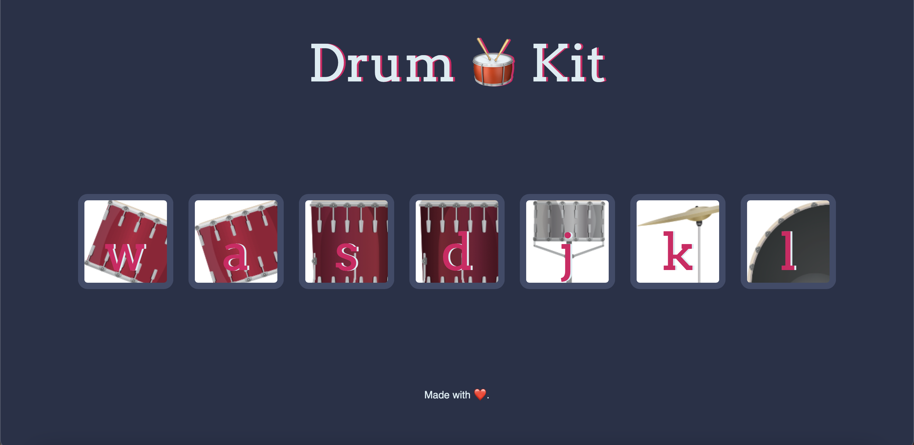

# Table of contents

- [Overview](#overview)
  - [Features](#features)
  - [Screenshot](#screenshot)
  - [Links](#links)
- [My process](#my-process)
  - [Built with](#built-with)
- [Author](#author)

## Overview

### Features

Users should be able to:

- Use keys on keyboard or click buttons for different drum sounds

### Screenshot

### Links

- Live Site URL: [https://michellewongi.github.io/drumkit/]

## My process

### Built with

- Semantic HTML5
- CSS
- JavaScript

# Author

- Michelle Wong [https://michellewong.me]

